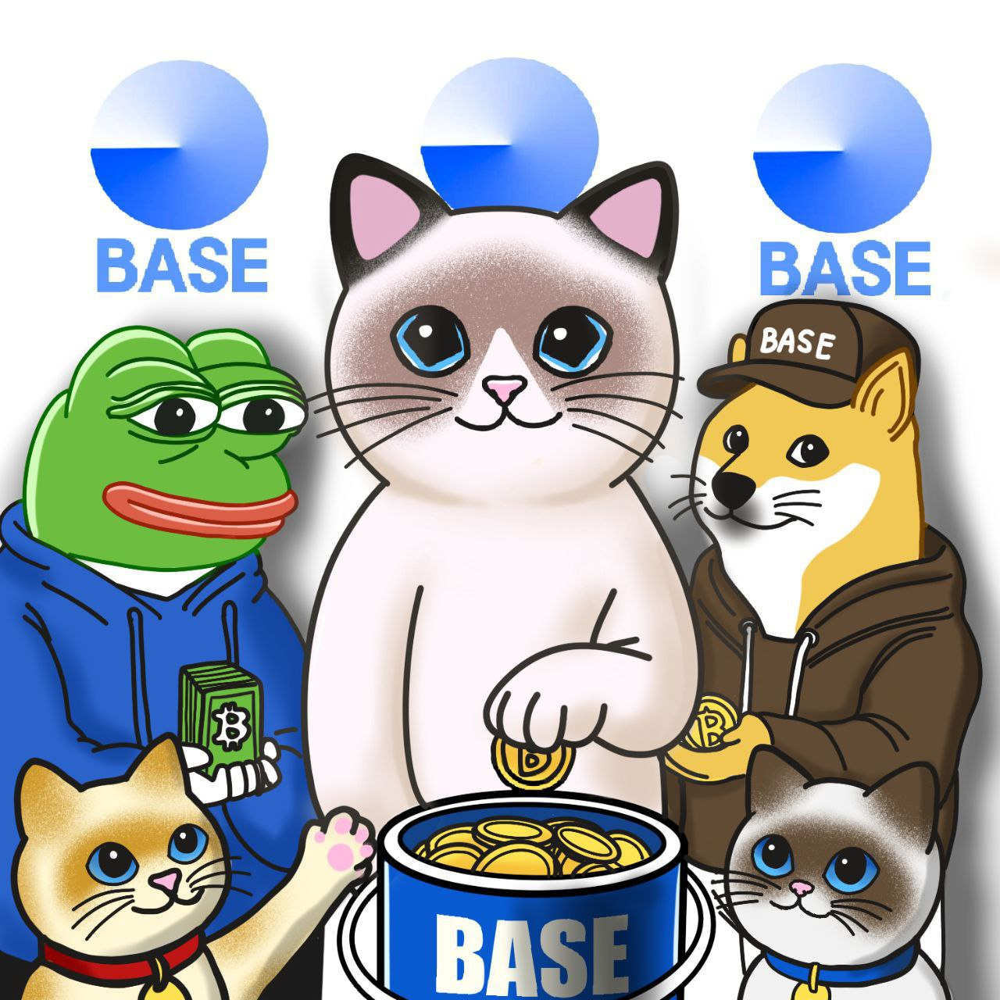

# RAGDOLL ERC-20 OFFICIAL

# [1] About the RAGDOLL

**Project Purpose  ::**
 - You agree that you are acquiring RAGDOLL to participate in the RAGDOLL ecosystem and to obtain services on the ecosystem thereon. The Company, the Distributor and their respective affiliates would develop and contribute to the underlying source code for the RAGDOLL ecosystem. The Company is acting solely as an arms’ length third party in relation to the RAGDOLL distribution, and not in the capacity as a financial advisor or fiduciary of any person with regard to the distribution of RAGDOLL.

**Nature of the Token Documentation  ::**
 - The Token Documentation is a conceptual paper that articulates some of the main design principles and ideas for the creation of a digital token to be known as RAGDOLL. The Token Documentation and the Website are intended for general informational purposes only and do not constitute a prospectus, an offer document, an offer of securities, a solicitation for investment, any offer to sell any product, item, or asset (whether digital or otherwise), or any offer to engage in business with any external individual or entity provided in said documentation. The information herein may not be exhaustive and does not imply any element of, or solicit in any way, a legally-binding or contractual relationship. There is no assurance as to the accuracy or completeness of such information and no representation, warranty or undertaking is or purported to be provided as to the accuracy or completeness of such information. Where the Token Documentation or the Website includes information that has been obtained from third party sources, the Company, the Distributor, their respective affiliates and/or the RAGDOLL early contributors have not independently verified the accuracy or completeness of such information. Further, you acknowledge that the project development roadmap, network functionality are subject to change and that the Token Documentation or the Website may become outdated as a result; and neither the Company nor the Distributor is under any obligation to update or correct this document in connection therewith.

## ▷ CHAIN INFO 
Chain : ERC-20 / BASE CHAIN 

## ▷ ALLOCATION OF FUNDS 
- Contract Address : 0xF5E89006CBeFf2dabCfda0Def5Bf45Ebe7f8429f
- Total Supply: 88,888,888,888 RAGDOLL

## ▷ Initial Distribution:

- Team: 10% 

- Marketing: 20%

- Donation Fund: 20%

- Liquidity Pool: 50%

## ROADMAP

**PHASE 1**
  
- WEBSITE & SOCIAL MEDIA LAUNCH
- AIRDROP ACTIVE WALLETS
- INITIAL MARKETING CAMPAIGNS
- TOKENOMICS RELEASE
- ROADMAP RELEASE
  
**PHASE 2**

- AUDIT 
- CEX LISTING
- CMC LISTING
- SOCIAL MEDIA MARKETING
- FIRST MEME CONTEST
- FURTHER PARTNERSHIPS
- COMMUNITY DEVELOPMENT

  
**PHASE 3**
  
- FURHER ECOSYSTEM DEVELOPMENT
- LISTING ON MAJOR CEX
- COMMUNITY GIVEAWAY
- ADVANCED MARKETING

## Technologies

- [Solidity]

# [2] WHAT IS RAGDOLL

The RAGDOLL project is a community dedicated to sharing the charm and appeal of Ragdoll cats with the world. Our goal goes beyond simply creating cat memes; we aim to offer an enjoyable experience. The project "RAGDOLL" seeks to share the allure of Ragdoll cats and widely distribute entertaining memes featuring them. The ultimate objective is to lead this project successfully through the participation and enthusiasm of all involved.

The RAGDOLL project aims not only to provide new enjoyment for cat lovers but also to open up the potential for continuous growth in the broader cat market. We look forward to growing this community together, offering new experiences to cat enthusiasts, and finding opportunities to further expand and develop the community through the scalability of WEB3.

We hope that through the Ragdoll project, more people will get to know Ragdoll cats and fall in love with their charm. Let’s embark on this wonderful journey together!

# [3] RAGDOLL Work
## RAGDOLL Power

- ### *Brand Power:*
  Ragdoll cats are already one of the famous cat breeds, and their popularity can hold high brand value in the cat-related products and content market. Investing in this project can enhance the brand value of Ragdoll cats and increase profitability related to their products and services.
- ### *Community Expansion:*
  The Ragdoll meme project offers opportunities to expand the community of cat lovers, providing various products and services through it. This not only offers more revenue generation opportunities but also helps attract more investors and cooperative partners.
- ### *Growth of the Cat Lover Market:*
  Cat enthusiasts continue to form a growing community. They have increasing demand for cat-related content and products, and this project can contribute to meeting that demand.
- ### *Understanding Cat Culture:*
  The project team has a good understanding of the culture and preferences of cat lovers. This serves as an important strength in creating cat-themed content and memes. This enables the Ragdoll meme project to accurately identify the target market and provide tailored content.
  
# [3] Contact
- 📧 henry@ragdoll.wtf
- 📋 [homepage](https://ragdoll.wtf/)
- 📋 [telegram](https://t.me/Ragdollwtf_bot)

